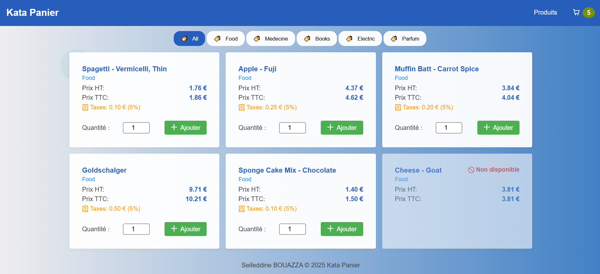

# Kata Panier – Shopping Cart Angular Application

## Project Description

Kata Panier is a modern, modular Angular application designed to manage a shopping cart of products. This project demonstrates best practices in Angular architecture, reactivity, maintainability, and design system implementation. It is ideal for learning, technical interviews, or as a robust starter for e-commerce and inventory management solutions. The application uses a mock backend powered by `json-server` for rapid development and testing.

## Table of Contents

- [Project Description](#project-description)
- [Screenshots](#screenshots)
- [Key Technologies](#key-technologies)
- [Accessibility](#accessibility)
- [Features](#features)
- [Architecture](#architecture)
- [Design System](#design-system)
- [Setup & Development](#setup--development)
- [State Management](#state-management)
- [API](#api)
- [Best Practices](#best-practices)
- [Customization](#customization)
- [Testing with Jest](#testing-with-jest)
- [How to Contribute](#how-to-contribute)
- [License](#license)

## Screenshots



## Key Technologies

- **Angular** (v19)
- **Angular Signals and ressource APIs** (v19)
- **TypeScript**
- **RxJS** (for state management)
- **SCSS** (design system)
- **Jest** (unit testing)
- **json-server** (mock API)

## Accessibility

This application is built with accessibility as a core principle, following WCAG 2.1 AA guidelines and RBAA (Role-Based Accessibility Assessment) principles to ensure an inclusive user experience for all users, including those using assistive technologies.

### Accessibility Standars Implemented

#### Semantic HTML & ARIA

- Proper HTML5 elements (`nav`, `main`, `article`)
- ARIA landmarks and roles
- Clear heading hierarchy (h1-h6)

#### ARIA Labels and Descriptions

- `Product Cards`: Each product card includes aria-label attributes describing the product name, price, and availability
- `Cart Counter`: Shopping cart icon includes aria-label="Panier avec {count} produits" for screen reader users
- `Action Buttons`: All interactive buttons have descriptive aria-label attributes (e.g., "'Ajouter ' + quantity + product().productName + 'au panier'")

#### Semantic HTML and ARIA Roles

- `Grouping`: Proper nav element with role="group" and aria-label="Filtres de catégories (bureau)"
- `Product Lists`: role="list" and role="listitem" for proper list semantics

## Features

- **Products Page**: List, filter by category, add to cart, select quantity, show price (HT/TTC), and stock status.
- **Cart Page**: View cart items, update quantity, remove items, see taxes and total, and empty cart message.
- **Navigation**: Switch between products and cart, with a live cart counter.
- **Responsive Design**: 3 cards per row on desktop, 1 per row on mobile.
- **Design System**: SCSS variables, mixins, and reusable components.
- **Reactive State**: Lightweight store service using RxJS (mini-NgRx/Akita pattern).

## Architecture

- **features/**: Feature modules (products, cart)
- **shared/**: Shared UI components and store service
- **core/**: Core services (API, etc.)
- **styles/**: Design system (SCSS variables, mixins, etc.)
- **db.json**: Mock database for `json-server`

## Design System

- All styles use SCSS variables and mixins from `src/styles/`.
- Responsive breakpoints and consistent spacing/colors.

## Setup & Development

### Prerequisites

- Node.js (v18+ recommended)
- npm

### Install dependencies

```bash
npm install
```

### Start the app and mock API

This will run both Angular and the JSON server concurrently:

```bash
npm run start:all
```

- Angular app: [http://localhost:4200](http://localhost:4200)
- Mock API: [http://localhost:3000](http://localhost:3000)

### Folder Structure

```
src/
  app/
    core/
      services/
        products-api.service
    features/
      cart/
        cart-card/
        cart-list/
        cart-summary/
      products/
        product-card/
        products-list/
    shared/
      components/
        app-header/
        cart-counter/
        footer/
      enums/
      models/
      store/
      utils/
  environments/
  main.ts
  styles/
    _buttons.scss
    _mixins.scss
    _typography.scss
    _variables.scss
```

## State Management

- All state (products, cart) is managed in `AppStoreService` using Angular Signals and RxJS.
- Components subscribe to observables for reactivity.
- All business logic (add, remove, update, clear) is encapsulated in the store service.

## API

- Products are fetched from `json-server` at `http://localhost:3000`.
- You can modify `db.json` to change the product list.

## Best Practices

- SOLID, KISS, DRY principles
- Strong typing with TypeScript interfaces
- Modular, maintainable folder structure
- Separation of concerns (features, shared, core)
- Reusable UI components and design system
- Unit tests for all business logic and components

## Customization

- Add new features by creating new modules/components in `features/` or `shared/`.
- Update the design system in `src/styles/` for global style changes.
- Extend the store service for more advanced state management.

---

## Testing with Jest

This project uses [Jest](https://jestjs.io/) for unit testing. Jest provides fast, easy-to-use, and highly configurable testing for JavaScript and TypeScript projects.

### Running Tests

To run all tests:

```bash
npm run test
```

### Test Coverage

To generate a test coverage report:

```bash
npm run test:coverage
```

The coverage report will be available in the `coverage/` directory. Open `coverage/lcov-report/index.html` in your browser to view detailed coverage information.

---
